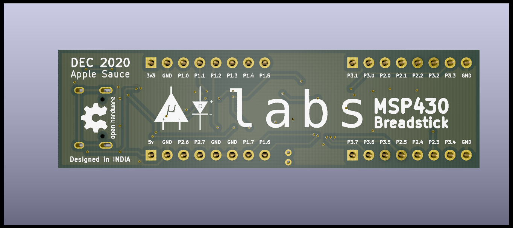
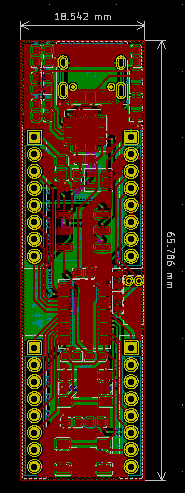

# MSP430 Breadstick

Upside Down Labs MSP430 Breadstick is a development board for ultra low power MSP430G2553 MCU from Texas Instruments. 

## Variant: Apple Sauce
Apple Sauce variant of MSP430 Breadstick comes with FT232RQ USB to UART bridge.

| Front              |  Back |
| :-------------------------: | :-------------------------: |
|   |  |

| Dimensions              |  Schematic |
| :-------------------------: | :-------------------------: |
| 65.786 x 18.542 mm  |  |

## License

#### Hardware
CERN Open Hardware License Version 2 - Strongly Reciprocal ([CERN-OHL-S-2.0](https://spdx.org/licenses/CERN-OHL-S-2.0.html)).

#### Software
MIT open source [license](http://opensource.org/licenses/MIT).

#### Documentation:
 This work is licensed under a <a rel="license" href="http://creativecommons.org/licenses/by/4.0/">Creative Commons Attribution 4.0 International License</a>.

